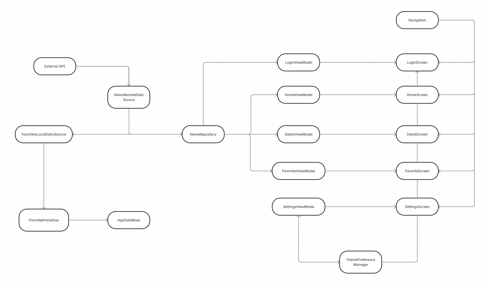

# NewsApp

## 🚀 Instalación

1. Clonar este repositorio.
2. Abrir el proyecto en Android Studio.
3. Configurar la variable `NEWS_API_KEY` en `local.properties` o en `BuildConfig` con tu API Key de [NewsAPI](https://newsapi.org).

## 🔐 Login

* Email: `admin@gmail.com`
* Contraseña: `123456`

## 📰 Pantalla principal (Home)

* Visualiza noticias destacadas.
* Usa la barra superior para buscar noticias específicas.

## 📄 Detalle de noticia

* Haz clic en una noticia para ver su detalle completo.
* Pulsa “Leer noticia completa” para abrirla en el navegador.
* Pulsa “Guardar como favorito” para almacenarla localmente.

## ⭐ Favoritos

* Accede a la pantalla de Favoritos desde la navegación inferior o lateral.
* Visualiza todas las noticias guardadas y elimínalas si lo deseas.

## ⚙️ Configuración

* Cambia entre tema claro y oscuro.
* Cierra sesión desde esta pantalla.

---

> 📃 **Documentación adicional** en la carpeta `doc/`.

---

### 📖 Resumen

Ver 

### 🔍 Diagrama de componentes

Ver  o la imagen exportada en la misma carpeta.

---

© 2025 NewsApp Project.
